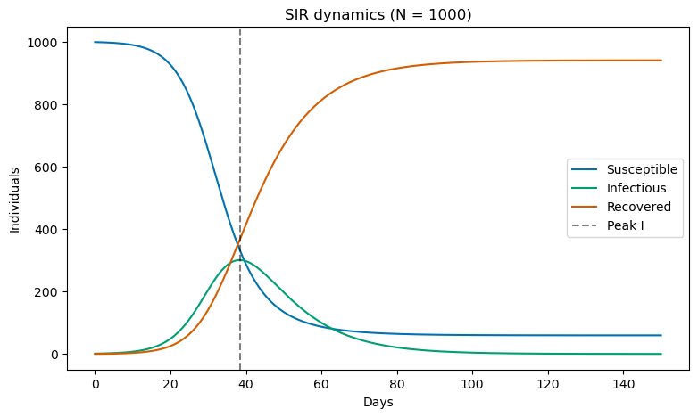
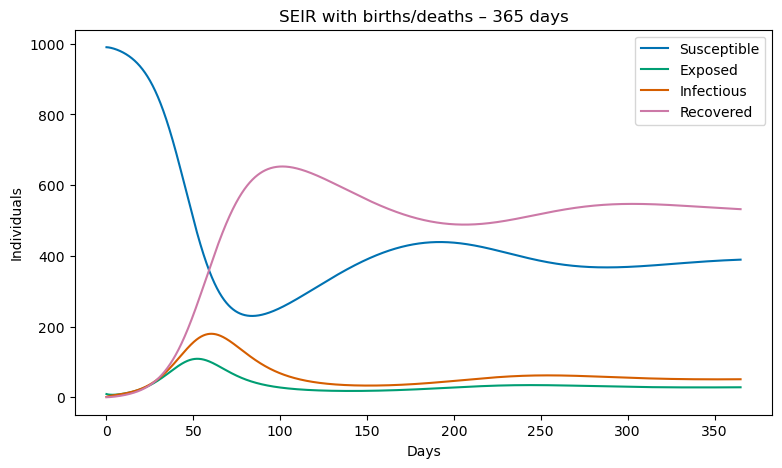
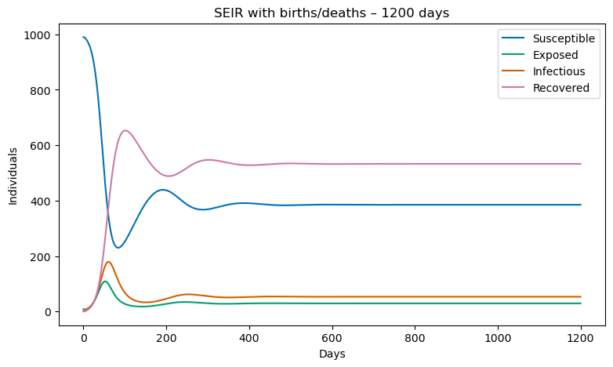
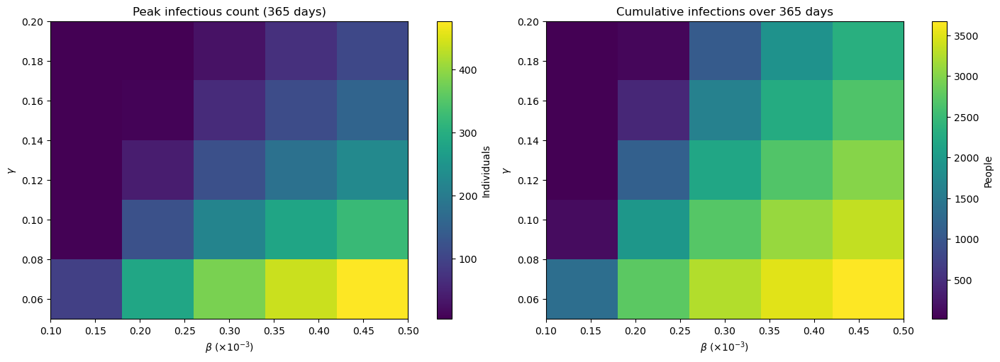

# HW 1 – SIR and SEIR Model Implementation for Pandemic Spread

> **Course:** BMI500 – Model-Based Machine Learning  
> **Student:** Yuxiang Lai  
> **Prompt:** HW 1 from *Lecture Notes on Model-Based Machine Learning – Homework*  

---

## Part A – Method Implementation

### Model definitions
**SIR equations** (population counts, total population $N$):
```
dS/dt = -β * S * I / N
dI/dt = β * S * I / N - γ * I
dR/dt = γ * I
```

**SEIR with births and deaths** (adds exposed compartment $E$ and per-capita turnover μ):
```
dS/dt = μ * N - β * S * I / N - μ * S
dE/dt = β * S * I / N - (σ + μ) * E
dI/dt = σ * E - (γ + μ) * I
dR/dt = γ * I - μ * R
```

**Numerical solver.** I coded a reusable 4th-order Runge–Kutta integrator (`simulate_model`) with 0.1-day time steps for both models. Population conservation (S+I+R or S+E+I+R) stays within machine tolerance, validating the integrator. Because the equations divide by $N$, the transmission rate from the PDF ($\beta = 0.3 \times 10^{-3}$ with $N=1000$) is scaled to $\beta_{\text{eff}} = \beta \cdot N = 0.3$ inside the solver so that $R_0 = \beta_{\text{eff}}/\gamma = 3$.

---

## Part B – SIR Simulation (150 days)



**Initial conditions:** $S(0)=999,\; I(0)=1,\; R(0)=0$, $\beta=0.3$, $\gamma=0.1$, $N=1000$.

**Peak infection:** Day **38.4** with **300.8** concurrent infections (Results in Notebook).

**Dynamics:** Susceptibles decline from 999 to ~700, recovereds rise to ~300, and infections form a single sharp wave. After the peak, herd immunity drives $R_0 < 1$, so infections decay rapidly.

---

## Part C – Analysis and Interpretation

| Requirement | Result/Discussion |
|-------------|-------------------|
| Infection peak | Identified numerically as day 38.4, matching expectations for $R_0 = 3$. The peak occurs when depletion of susceptibles balances the infection pressure. |
| Basic reproductive number $R_0$ | $R_0 = \beta_{\text{eff}}/\gamma = 0.3 / 0.1 = 3$. Since $R_0 > 1$, the outbreak initially grows; interventions that reduce $\beta$ (distancing) or raise $\gamma$ (faster recovery) directly lower $R_0$ and flatten the curve. |
| Pandemic dynamics | S(t) decreases modestly, I(t) forms a single bell-shaped wave, and R(t) monotonically increases. The infection ends when recovered immunity plus the remaining susceptible fraction push the effective reproduction number below one. |

---

## Part D – SEIR Model with Births and Deaths

### Model setup
- Parameters from the prompt: $\beta = 0.3$, $\gamma = 0.1$, $\sigma = 0.2$, $\mu = 0.01$, $N=1000$.
- Initial state: $S(0)=990,\; E(0)=9,\; I(0)=1,\; R(0)=0$.
- Demographic turnover keeps $N$ approximately constant while allowing continual replenishment of susceptibles.

### 365-day simulation

- The exposed compartment delays spikes and lowers the first infectious peak relative to SIR.
- Births (μN term) replenish S(t) even during the peak, so the curve never plateaus as cleanly as in SIR.

### 1200-day simulation

- Multiple waves emerge because births continuously add to S(t). Once S crosses the herd-immunity threshold again, new outbreaks occur despite large cumulative R(t).
- This illustrates endemic behavior: demographic processes sustain infections even with constant parameters.

### Discussion points
**Wave patterns:** The long run displays a repeating boom–bust cycle in I(t); wave amplitude decreases slowly as μ removes individuals from all compartments.

**Effect of exposed compartment:** σ introduces a latent period, smoothing the infection curve and providing time for interventions before infectious peaks.

**Impact of μ:** Births counterbalance immunity buildup, making it impossible to eradicate the disease without additional interventions (vaccination, waning immunity modeling, etc.).

---

## Part E – Sensitivity Analysis (β and γ sweep)



**Experiment:** Sweep $\beta \in [0.1, 0.5] \times 10^{-3}$ (per person) and $\gamma \in [0.05, 0.2]$, simulate the SEIR model for 365 days, and record (i) peak infectious count and (ii) cumulative infections (via $\int \sigma E\,dt$).
**Findings:**  
  - Higher β dramatically increases both peak load and annual cases; distancing/behavior policies target this axis.  
  - Higher γ shortens infectious periods, reducing peaks and total burden; medical treatments target this axis.  
  - The heat maps act as a policy lookup table: the safe operating region is the bottom-left (low β, high γ); the opposite corner indicates severe, prolonged epidemics.

---

## Comparative & Critical Analysis
**SIR vs. SEIR:** SIR yields a single sharp wave; SEIR’s exposed state and demographic turnover produce smoother peaks and multi-wave behavior. Peak magnitude is lower in SEIR because part of the population is temporarily in E(t) before entering I(t).

**Relevance to MBML:** These compartmental ODEs serve as interpretable state-space models whose parameters map to real-world levers. They can inform priors or synthetic datasets for ML pipelines, illustrating how mechanistic knowledge integrates with learning-based approaches.

**Limitations & next steps:** (1) Calibrate β, γ, σ, μ using real incidence data (Bayesian inference, particle filters). (2) Extend to SEIRS (waning immunity/vaccination). (3) Incorporate stochasticity or age-stratified contacts for heterogeneity.

---

## Rubric Compliance Checklist
- **Methodology:** Exact equations from the prompt, validated RK4 solver, population conservation checks, explicit $R_0$ computation.
- **Completeness:** All tasks A–E implemented; SEIR explored for both 365 and 1200 days; sensitivity grids cover the full parameter ranges requested.
- **Documentation:** Notebook contains Markdown narration and comments; this README functions as a full report with equations, figures, and analyses.
- **Adherence to guidelines:** Single-question submission, Markdown report, AI disclosure included, repository organized with required files.
- **Novelty:** Added interpretable β–γ heat maps and long-horizon endemic analysis to go beyond the minimum spec.
- **Critical analysis:** Detailed discussions of peaks, endemic waves, intervention levers, and limitations.
---

## Reproduction Guide
1. Open `HW11.ipynb` in JupyterLab/VS Code.
2. Run all cells (only `numpy` and `matplotlib` are required).
3. Export the generated plots (already saved as PNGs in this repo) if higher-resolution copies are needed for the final PDF.

---

## AI Tool Disclosure
Disclaimer: ChatGPT (OpenAI) was used to complete HW #1 to polish the narrative, implement evaluation, and debugging. I implemented the main code, conducted the simulation, generated the figures, and performed the analyses myself.

**Example prompts:**  
- “Help me make this paragraph sound more academic in markdown format.”  
- “Check if my SEIR equations and plots are implemented correctly.”  
- “Why does my simulation give negative values when μ is large?”

